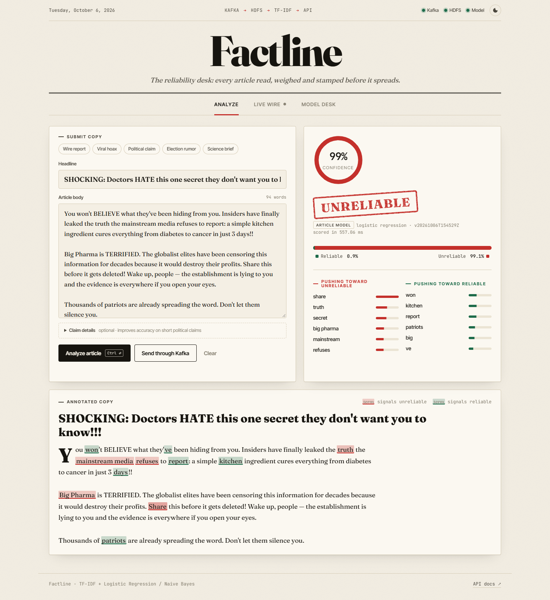
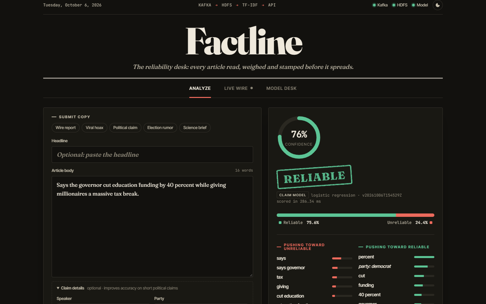
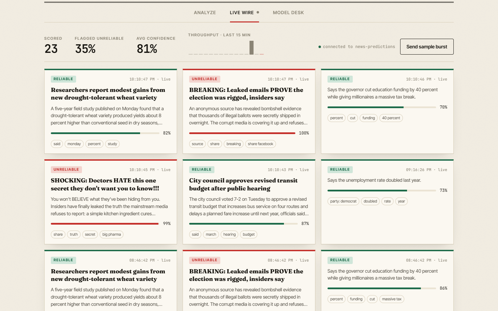
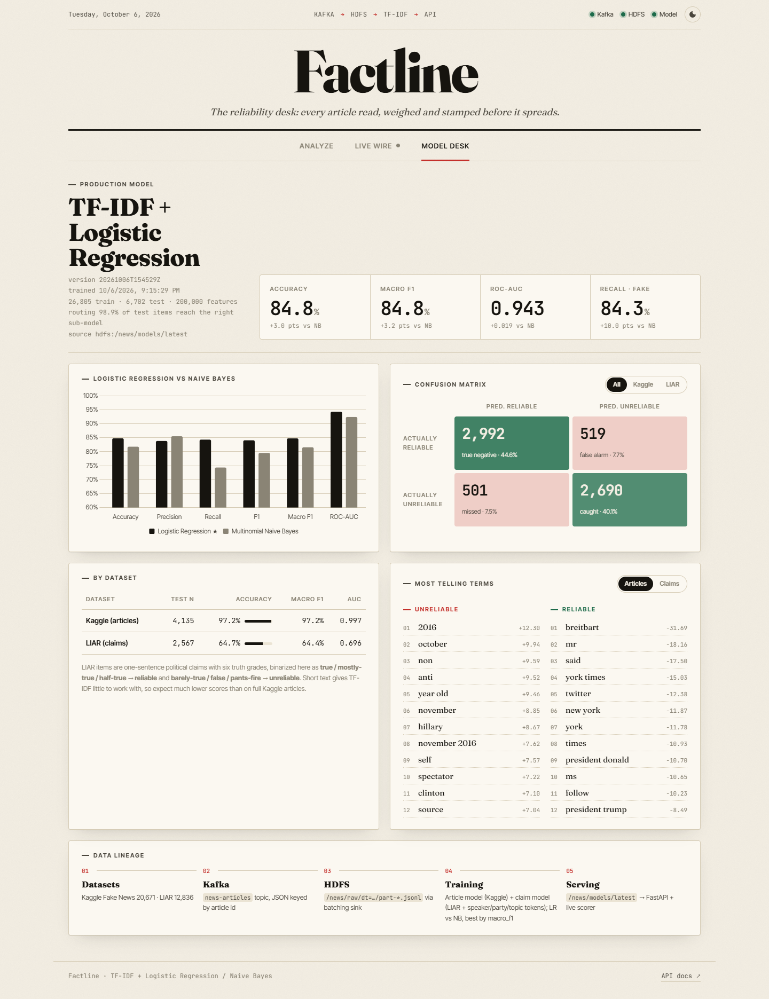
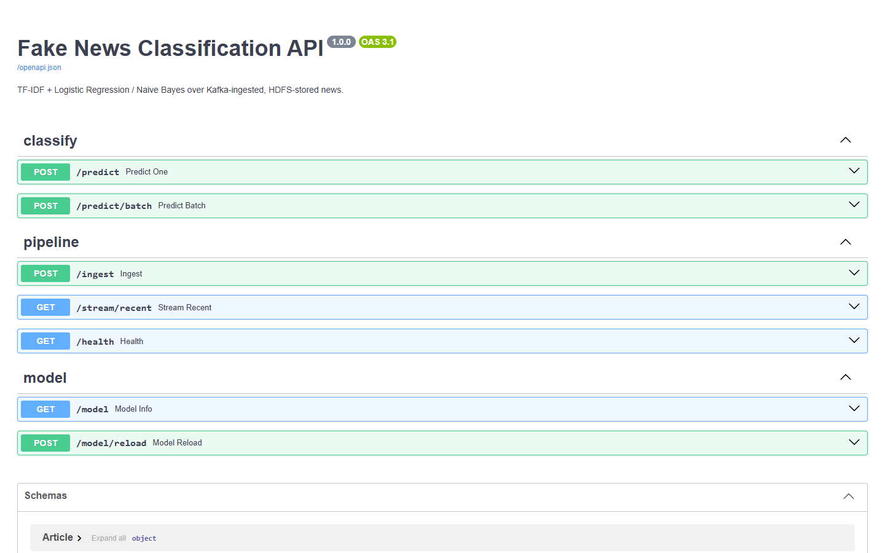

# Factline: Fake News Classification Pipeline

Manual fact-checking can't keep up with the volume of published articles. Factline:
- ingests articles through **Kafka**
- lands them on **HDFS**
- trains a **TF-IDF + Logistic Regression / Naive Bayes** classifier
- serves a *reliable* / *unreliable* verdict with a confidence score through a **FastAPI** service and a web UI.

```
 Kaggle Fake News + LIAR ─► producer ─► Kafka "news-articles" ─► hdfs-sink ─► HDFS /news/raw/dt=…/part-*.jsonl
                                                                                     │
                                                                     trainer ◄───────┘  (TF-IDF → LR vs NB, best by macro-F1)
                                                                        │
                                                        HDFS /news/models/{latest,v<ts>}/model.joblib + metrics.json
                                                                        │
  Web UI / curl ─► FastAPI  /predict  /ingest  /stream/recent  /model  /health
                      │ /ingest
                      ▼
               Kafka "news-incoming" ─► live-scorer ─► Kafka "news-predictions" ─► Live Wire UI
                                                   └─► HDFS /news/predictions/
```

## Screenshots

**Analyze:** the verdict, confidence gauge, the words that drove the decision, and the article annotated with them.



<table>
<tr>
<td width="50%"><b>Claim model, dark theme</b>: short political claim with optional speaker/party/topic details<br></td>
<td width="50%"><b>Live Wire</b>: articles sent through Kafka, scored in real time by the live scorer<br></td>
</tr>
</table>

**Model Desk:** LR vs NB comparison, confusion matrix, per-dataset scores, most telling terms and data lineage.



**API docs** (Swagger UI at `/docs`):



## Stack

| Layer | Tech |
|---|---|
| Messaging | Apache Kafka 3.8 (KRaft, single broker) |
| Storage | Apache Hadoop 3 HDFS (NameNode + DataNode), accessed via WebHDFS |
| NLP / ML | scikit-learn: `TfidfVectorizer` (1–2 grams, sublinear TF) + `LogisticRegression` / `MultinomialNB`, routed article/claim sub-models |
| Serving | FastAPI + Uvicorn; vanilla JS UI with Chart.js |
| Orchestration | Docker Compose |

## Datasets

| Dataset | What it is | How it is labeled here |
|---|---|---|
| Kaggle Fake News (UTK ML Club, 2018). The competition page is offline, so it comes from this [verified mirror](https://huggingface.co/datasets/Reyansh4/Fake-News-Classification) | 20.8k full news articles (`id, title, author, text, label`) | `label` 1 means unreliable, 0 means reliable (used as-is) |
| [LIAR](https://www.cs.ucsb.edu/~william/data/liar_dataset.zip) (Wang, 2017) | ~12.8k short political claims with 6 truth grades | `true / mostly-true / half-true` count as **reliable**; `barely-true / false / pants-fire` count as **unreliable** |

The original LIAR grade is kept in `label_raw`. Metrics are reported overall **and per dataset**. LIAR claims are only one sentence long, so expect roughly 60–65% accuracy there, versus 95%+ on full Kaggle articles.

## Quick start (Windows / macOS / Linux, Docker Desktop running)

```bash
# 1. Get the data -> data/raw/{kaggle,liar}/   (~100 MB, no account needed)
python scripts/download_data.py
#    …or, if you already have the Kaggle train.csv:
python scripts/download_data.py --kaggle-csv path/to/train.csv

# 2. Start Kafka + HDFS; `init` creates the topics and HDFS directories
docker compose up -d --build kafka namenode datanode init

# 3. Ingest: start the HDFS sink, then stream every article through Kafka
docker compose up -d hdfs-sink
docker compose run --rm producer                 # add --rate 50 for a slow "live" demo

# 4. Train on what landed in HDFS (prints LR vs NB, uploads the best model to HDFS)
docker compose run --rm trainer

# 5. Serve
docker compose up -d api live-scorer
# UI       http://localhost:8000
# Swagger  http://localhost:8000/docs
# HDFS UI  http://localhost:9870   (Utilities → Browse the file system → /news)
```

## Model

One shared vocabulary served long articles and one-sentence claims poorly, so the model is **routed**:

| Sub-model | Trained on | Input |
|---|---|---|
| **article** | Kaggle Fake News | headline + body (first 10k chars), word 1–2-gram TF-IDF |
| **claim** | LIAR | statement + metadata tokens (`spk_…`, `party_…`, `subj_…`, `ctx_…`, `st_…`) |

**Routing rule:** an input goes to the claim model if claim metadata is supplied, or if it has no headline and fewer than 60 words. Everything else goes to the article model. The trainer scores the test set *through this rule*, not by the known source, so routing mistakes count against the model. About 98.9% of test items reach the right sub-model.

For each sub-model the trainer fits both Logistic Regression and Naive Bayes on the same TF-IDF matrix, and keeps whichever classifier type has the better overall macro-F1.

**Results** (stratified 80/20 split; 6,702 test items):

| | Overall acc | Kaggle acc | LIAR acc | ROC-AUC |
|---|---|---|---|---|
| Single shared model (v1) | 82.5% | 96.9% | 59.4% | 0.921 |
| **Routed LR (current)** | **84.8%** | **97.2%** | **64.7%** | **0.943** |
| Routed NB | 81.8% | 93.4% | 63.1% | 0.924 |

**What else was tried and didn't help:**
- tuning C
- Complement NB
- character 2–5-grams
- adding each speaker's leakage-adjusted track record (+0.2 pts, but it needs data the API can't supply for new articles).

LIAR results (about 60–65% binary) are in line with what text-based models usually reach on this dataset.

## API

| Method | Path | Description |
|---|---|---|
| POST | `/predict` | `{title?, text, speaker?, party?, subject?, context?, state?}` returns `{label, confidence, probabilities, route, top_terms[], model, model_version, latency_ms}` |
| POST | `/predict/batch` | List of articles (≤ 500) returns a list of predictions |
| POST | `/ingest` | Publishes an article to Kafka `news-incoming`; the live scorer classifies it asynchronously |
| GET | `/stream/recent?limit=50` | Latest verdicts from Kafka `news-predictions` |
| GET | `/model` | Metrics for both models, per-dataset scores, confusion matrices, top terms |
| POST | `/model/reload` | Reloads `/news/models/latest` from HDFS |
| GET | `/health` | Status of Kafka, HDFS and the model |

```bash
curl -s -X POST localhost:8000/predict -H "Content-Type: application/json" \
  -d '{"title":"SHOCKING secret they do not want you to know","text":"Share this before it gets deleted!"}'
```

```json
{
  "label": "unreliable",
  "confidence": 0.97,
  "probabilities": {"reliable": 0.03, "unreliable": 0.97},
  "top_terms": [{"term": "share", "weight": 0.41, "direction": "unreliable"}, "..."],
  "model": "logistic_regression",
  "model_version": "20261006T120000Z",
  "latency_ms": 3.1
}
```

`confidence` is the predicted class's probability (`predict_proba`). `top_terms` are the TF-IDF features in this article that contributed most to the decision:
- Logistic Regression: TF-IDF value × coefficient
- Naive Bayes: TF-IDF value × log-likelihood ratio

## Web UI

- **Analyze**
  - Paste an article, or load one of the samples.
  - The result shows an animated confidence gauge, a verdict stamp, the class probabilities, and the words pushing each way.
  - The full text is annotated, with influential terms highlighted.
- **Live Wire:** articles sent through Kafka (*Send through Kafka* or *Send sample burst*) appear as they are scored, with throughput and flag-rate counters.
- **Model Desk**
  - KPI tiles and an LR vs NB comparison chart.
  - A confusion matrix you can filter by dataset, plus a per-dataset breakdown.
  - The most telling terms and the data lineage.

The UI has light and dark themes and works at phone width.

## Project layout

```
config.py               env-driven settings (topics, HDFS paths, bootstrap servers)
pipeline/
  schema.py             Kaggle / LIAR → unified record (+ LIAR binarization)
  preprocess.py         clean_text / model_input
  kafka_io.py           producer/consumer factories, topic creation
  hdfs_io.py            WebHDFS helpers (jsonl read/write, bytes)
  producer.py           datasets → Kafka
  hdfs_sink.py          Kafka → HDFS jsonl partitions (commit after write = at-least-once)
  model.py              TF-IDF + classifiers, predict(), per-prediction explanations
  train.py              HDFS → train/compare → model + metrics → HDFS
  registry.py           load latest model (HDFS first, local fallback)
  live_scorer.py        Kafka news-incoming → predict → news-predictions + HDFS
api/main.py             FastAPI service
api/static/             web UI (index.html, styles.css, app.js)
scripts/download_data.py, scripts/init_infra.py
tests/                  pytest: schema, preprocessing, API
```

## Development without Docker

```bash
pip install -r requirements.txt
pytest                                       # unit + API tests (no Kafka/HDFS needed)
python -m pipeline.train --from-local        # train straight from data/raw, saves to models/
uvicorn api.main:app --reload                # falls back to models/model.joblib when HDFS is down
```

Running pipeline scripts on the host against the Dockerized cluster works for Kafka (`KAFKA_BOOTSTRAP=localhost:29092`, the default). WebHDFS is different: it redirects data reads and writes to the DataNode's container address, so HDFS jobs should run inside Compose (`docker compose run --rm …`).

## Notes and limitations

- The datasets (`data/raw/`) and trained models (`models/`, HDFS) are not committed. Steps 1–4 of the quick start reproduce them in about 10 minutes.
- Single-broker Kafka, single-DataNode HDFS with `replication=1`. This is a teaching and demo cluster, not production.
- TF-IDF models learn source style and vocabulary, not truth. The model flags *linguistic patterns associated with unreliable sources*, so treat it as triage for human fact-checkers, not as a verdict on facts.
- Articles are capped at 10,000 characters before vectorizing, to keep the bigram vocabulary manageable.

## License

The code is released under the [MIT License](LICENSE).

The datasets are not part of this repository and keep their own licences:
- LIAR (Wang, 2017)
- the Kaggle Fake News data, fetched via the Hugging Face mirror (CC-BY-ND-4.0).
